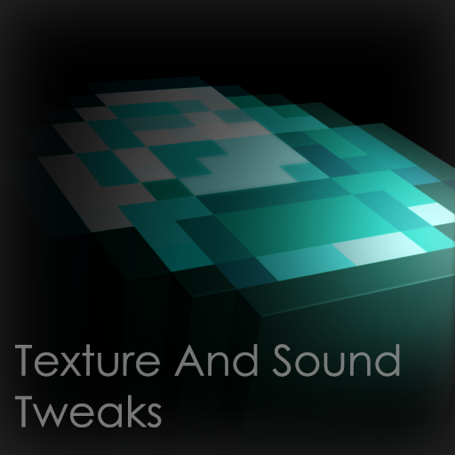

# Amiee's Textures & Sound Tweaks
A [WORK IN PROGRESS] Minecraft Resource-Pack that tweaks the sounds, textures, and sprites of the game to be a little more consistent with everything else! Also adds some extra stuff like new music and tweaks to a few existing mods!
- Vanilla Minecraft
- Roughly Enough Items (UI Texture Tweaks)
- Bewitchment (Various Texture Tweaks)
- AmbientSounds5 (Volume Tweaks)
- Appleskin (Icon Changes)
- Better Nether (Cinnica-idk Texture Refresh)
- Dynagear (Iron Hammer Texture Refresh)
- Vanilla Items (Hammer Sprite Refreshes)

# Credits:
Freesound: <https://freesound.org/>
  - Source for Creative Common Sound Effects

Vanilla Tweaks: <https://vanillatweaks.net/>
- Reference .json files (so I could learn to create my own)
- Reference and Placeholder for Diminishing Items sprites
- Diminishing Items .json files
- Hopper underside texture placeholder
- Block-entity break particles fix
- Double Slab fix
- 3D Stonecutters, Sugar Canes and Iron Bars
- Lower Shield (slightly modified)

Blockbench: https: <https://blockbench.net/>
- Minecraft model and texture creator/editor
    - Model for "The Sun"
    - Unused models for shields
    - Model for Brewing Stand

Optifine Discord:
- Help with troubleshooting "MC-Bow" models (@Mr_Negatron_YT#8416)
- Help with troubleshooting end bedrock ctm (@_Guide_#9900 and Pomik108#1378!)

Music:
- Lena Raine ~ Starjump - Celeste OST [Placeholder Dragon Fight Track]
- C418 ~ Minecraft: Volume Alpha/Beta [Credit Tracks]
- C418 ~ Minecraft: Volume Alpha [Edited Menu Tracks and Ingame Tracks imported from the Album]

  

# Tweaks from Vanilla Minecraft
## Texture Changes:
### Block Textures:
- Imported 1.19 Cocoa Pod texture fix
- Imported 1.18 texture fixes
- Imported 1.17 Smoker top textures
- Imported Updated 1.17 Blackstone textures
- Imported Updated 1.17 Ore textures
    - Added variations to all Ore textures
- Slightly tweaked Stone and Deepslate textures
    - Added variations to all Stone/Deepslate textures
    - Added variations to all it's cobbled counterparts as well
- Slightly tweaked Dirt texture
- Tweaked Soul Lantern and Copper Lantern textures
- Tweaked Observer top texture
- Tweaked Stonecutter bottom texture
- Added top texture for Gilded Blackstone
- Added top texture to Gilded Blackstone
- Added bottom texture to Crafting Table
- Added textures to Farmland side and it's different moistness stages 
- Added bottom, side, and end textures to Hopper
- Added bottom texture to Melon and Pumpkin Blocks
- Added custom textures to Petrified Oak Slabs
- Added custom texture to the Lever's Cobblestone base
- Added animation to the powered Lightning Rod texture
- Added an animation to the side of Honey Blocks
- Added missing shading to Grass Path side
- Added parity to block and item form of Ender Eyes
- Added parity to block and item form of Flower Pots
- Added missing interpolation to Lantern, Soul Lantern, and Copper Lantern animations
- Added missing interpolation to Lava texture animations
- Added missing colour-shifting animation to Prismarine Bricks
- Added missing interpolation to Sea Lantern texture animations
- Added missing interpolation to Water texture animations
- Made Campfire, Soul Campfire, Fire, and Soul Fire animations loop more smoothly
- Replaced ash with Soul Soil/Sand in Soul Campfires
- Changed Blackstone top texture
- Changed Brewing Stand model and added a bottom texture
- Slightly changed End Portal Frame side
- Changed Fletching Table's arrows to have Flint arrowheads
- Fixed the tiling of Stripped Logs/Stems
- Fixed Tall Seagrass and Coral Plant textures clipping out of the water

### Entity textures:
- Added emissive textures to some entities *[Requires Optifine]*
- Added missing detail to Polar Bear texture
- Added missing detail to Cat textures
- Added missing detail to Ender Dragon texture
- Added missing detail to Temperate Fox Texture
- Added animations to Conduit eye textures
- Updated Creeper texture
    - Changed Creepers to be textured accordingly. (e.g. desert creepers would be sand coloured, cave creepers would be stone-colored, etc) *[Requires Optifine/CET]*
- Changed End Crystal Texture
- Added parity to entity and item form of Saddles
- Updated Iron Golem texture
    - Added shading to damaged states
    - Added parity by changing yellow flowers to red
- Changed Arrowhead to Flint to match crafting recipe
    - Imported 1.17 Spectral Arrow textures
    - Changed Tipped Arrow textures
- Imported 1.17 Sign textures
- Changed angry and tamed Wolf texture
- Added Bottom texture to Blaze's rods
- Added parity to entity and item form of Leads
- Slightly changed Shield texture
- Slightly added variation to Trident riptide
- Simplified Witch texture

### GUI Sprites:
- Darkened Advancement Screen backgrounds
- Changed Combat Cooldown icons for both Crosshair and Hotbar to be more readable.
- Changed Map Background texture and Map Icon sprites to be more detailed
- Changed Container GUIs
    - Changed recipe book button in Crafting Table GUI
    - Changed the Instant Health, Instant Harm, and Saturation effect icons
    - Slightly tweaked the Hunger effect icon
    - Slightly tweaked Beacon GUI
    - Fixed Furnace, Blast Furnace, Smoker, and Brewing Stand GUI
    - Updated Smithing Table GUI
    - Updated Cartography Table GUI
    - Updated Enchantment Table GUI
    - Updated Stats Icons
    - Updated Hotbar/HUD Icons
    - Updated Recipe Book GUI
    - Updated Toasts

### Item Textures:
- Added emissive textures *[Requires Optifine]*
- Added diminishing item sprites to weapons and tools (sprite changes as the durability gets lower)
- Added new item sprites for Azalea, Flowering Azelea, Big Dripleaf, Small Dripleaf, Spore Blossoms, Dragon Egg, and Shields
- Added particle to broken Shields (don't look at the "items" folder cuz it is a little cursed)
- Added particle to consumed Enchanted Golden Apples
- Added Fishing Rod bobber colours to Fishing Rod
- Added parity to Gold Ingot and Golden Nugget colours
- Added custom item sprites for Torch, Redstone/Soul Torch, and Levers
- Added missing shading to all Music Disc sprites to match The Texture Update's Disc 11
- Added missing shading to weapons and tools to match The Texture Update's Swords
- Tweaked Arrows to have a Flint Tip
- Tweaked Trident item sprite to match it's Model counterpart
- Tweaked End Crystal item sprite
- Tweaked Hopper item sprite
- Tweaked sprites of Signs
- Tweaked Netherite tools and armour sprites to look less like stone tools
- Tweaked the Spyglass colours to match its crafting materials (Copper and Amethyst)
- Tweaked Turtle Egg sprite to make its corners brighter
- Imported Clock, Compass, and Sugar Cane sprites from 1.17
- Removed eating particle from Stews

### Misc Textures:
- Added new Server and Unknown Server icons
- Added missing shading to underwater overlay
- Added extra detail to nausea, spyglass, and freezing overlays
- Made Pumpkin overlay slightly transparent and less squished
- Made vignette overlay more smooth
- Made enchantment glint less obtrusive
- Made world border texture less noisy and obtrusive
- Made worn Netherite Armour texture less bland
- Tweaked Creebet and Pig Scene paintings

## Particle Textures:
- Tweaked Explosion, Soul, Sparkle, Spark, Instant Effect, Sonic Boom, and Sweep particle animations
- Added animation to Bubble Colum and Fishing particles
- Added custom Spit particles

### Optifine Textures:
- Added broken state for Trident
- Added sprites for Easter Egg Nametags
- Added End dimension textures for Bedrock Obsidian, Crying Obsidian, Fire, and Iron Bars *[CTM]*
- Added connected textures for Vines

## Sounds and Music Changes:
### Ambient Sounds:
- Added Cave Chimes to the list of cave sounds
- Added Disc 13 clips to the list of cave sounds
- Added randomised Fire and Water ambient sounds
- Added unique Lightning Strike sounds

### Block Sounds:
- Added placing and breaking sounds to Anvils
- Added sound variants for using Bubble Columns
- Added new sounds for Gilded Blackstone, Slime Blocks, Glass, Ladders, and Metal/Mineral Blocks
- Added breaking sounds to Stone, Dripstone, Tuff, Basalt, Bone Block, Sand, Netherbrick, Netherrack, Coral, Gravel/Dirt, Wooden, and Wool Blocks
- Added new unique sound variants for Redstone component blocks
- Added sound variants for and tweaked the Ender Chest closing sound
- Added unique sounds for a player using a Smithing Table
- Tweaked sounds for Deepslate, Deepslate Bricks, Deepslate Tiles, Pointed Dripstone, Netherite Block, and Ancient Debris
- Changed Nether Roots step sound to be a pitched down version of Nether Sprouts step sound

### Item Sounds:
- Added Egg, Snowball, Enderpearl, and Potion/Exp Bottle throw sounds
- Added Fishing Bobber splash sounds
- Added Chorus Fruit teleport sounds
- Added Elytra Equip sounds
- Added Crossbow Arrow hit sounds
- Added sound variants to Fire Charge and Flint and Steel use
- Added Shield breaking sounds

### Entity Sounds:
- Increased Blaze sounds' attenuation distance to 50
- Added unique Blaze burn and shoot sounds
- Added unique Creeper fuse sound
- Added unique Ender Dragon Fireball explode sounds
- Tweaked Ender Dragon idle, hurt, and death sounds
- Added unique Ender Dragon shoot sound
- Added custom Endermite sounds
- Tweaked some of the mobs' idle, hurt, or death sounds
    - Added reverb to Ghast noises
    - Added reverb and echo to Ender Dragon sounds
    - Removed background noise from Chicken and Pig sounds
    - Tweaked Guardian shoot and curse sounds
- Added drinking sound variants
- Tweaked the volume of eating sounds
- Added custom Magma Cube sounds
- Tweaked Player attacking sounds
- Added Player death sound
- Added Armour Stand place and fall sounds
- Added Splash Potion break sounds
- Added Wither block break variations

### Music:
- Adjusted the new music's weight values so that they don't completely overtake the old music
- Added music to Warped Forests
- Added rare variant to Disc 11
- Made some Music Discs sound like they're being played from a gramophone (Added scratches and noise)
- Extended "credits.ogg"
- Remixed "otherside" with BGC418
- Tweaked and adjusted new 1.18/1.19 music (to be less loud)
- Added old versions of 'Wet Hands' and 'Mice on Venus'

Misc Sounds:
- Added unique sounds for End Gateways spawning
- Added randomised Fire extinguish sounds
- Added randomised sounds for succesfully hitting a player with an arrow in multiplayer
- Added custom version of Menu button click sounds